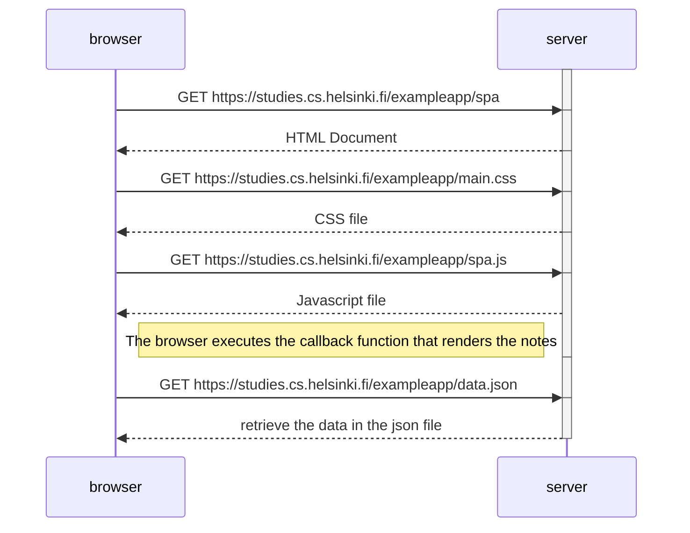

```mermaid
sequenceDiagram
    participant browser
    participant server

    activate server
    browser->>server: GET https://studies.cs.helsinki.fi/exampleapp/spa
    deactivate server
    activate server
    server-->>browser: HTML Document
    deactivate server

    activate server
    browser->>server: GET https://studies.cs.helsinki.fi/exampleapp/main.css
    deactivate server
    activate server
    server-->>browser: CSS file
    deactivate server

    activate server
    browser->>server: GET https://studies.cs.helsinki.fi/exampleapp/spa.js
    deactivate server
    activate server
    server-->>browser: Javascript file
    Note right of browser: The browser executes the callback function that renders the notes
    deactivate server

    activate server
    browser->>server: GET https://studies.cs.helsinki.fi/exampleapp/data.json
    deactivate server
    activate server
    server-->>browser: retrieve the data in the json file
    deactivate server
```
