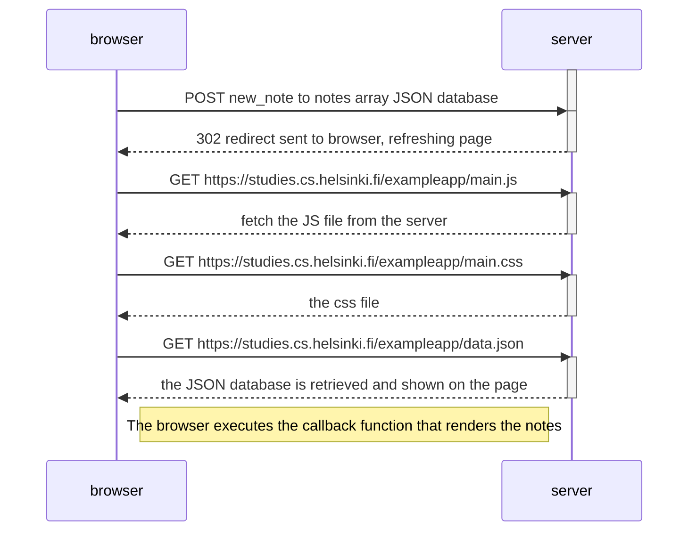

```mermaid
    sequenceDiagram
    participant browser
    participant server

    activate server
    browser->>server: POST new_note to notes array JSON database
    deactivate server
    activate server
    server-->>browser: 302 redirect sent to browser, refreshing page
    deactivate server

    browser->>server: GET https://studies.cs.helsinki.fi/exampleapp/main.js
    activate server
    server-->>browser: fetch the JS file from the server
    deactivate server

    browser->>server: GET https://studies.cs.helsinki.fi/exampleapp/main.css
    activate server
    server-->>browser: the css file
    deactivate server

    browser->>server: GET https://studies.cs.helsinki.fi/exampleapp/data.json
    activate server
    server-->>browser: the JSON database is retrieved and shown on the page
    deactivate server


    Note right of browser: The browser executes the callback function that renders the notes
```
